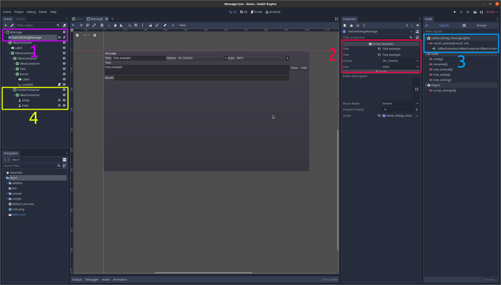
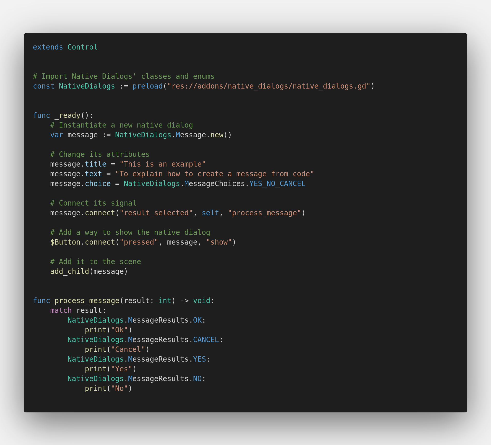
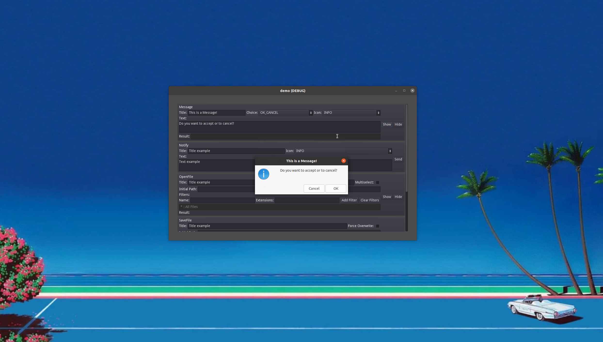
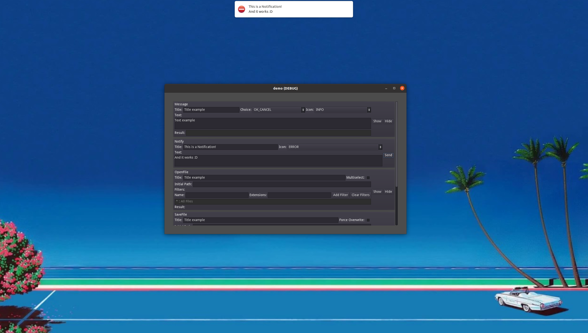
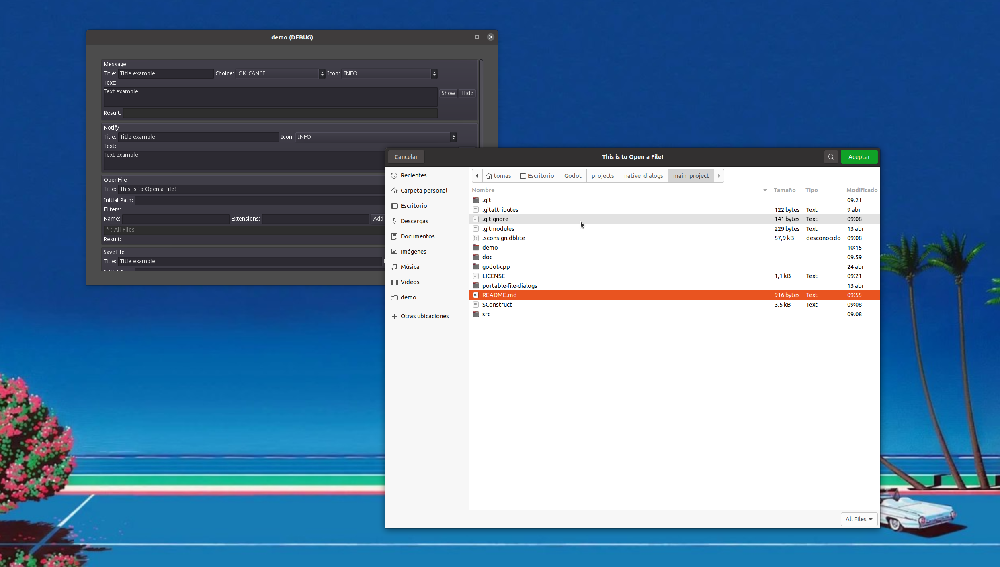
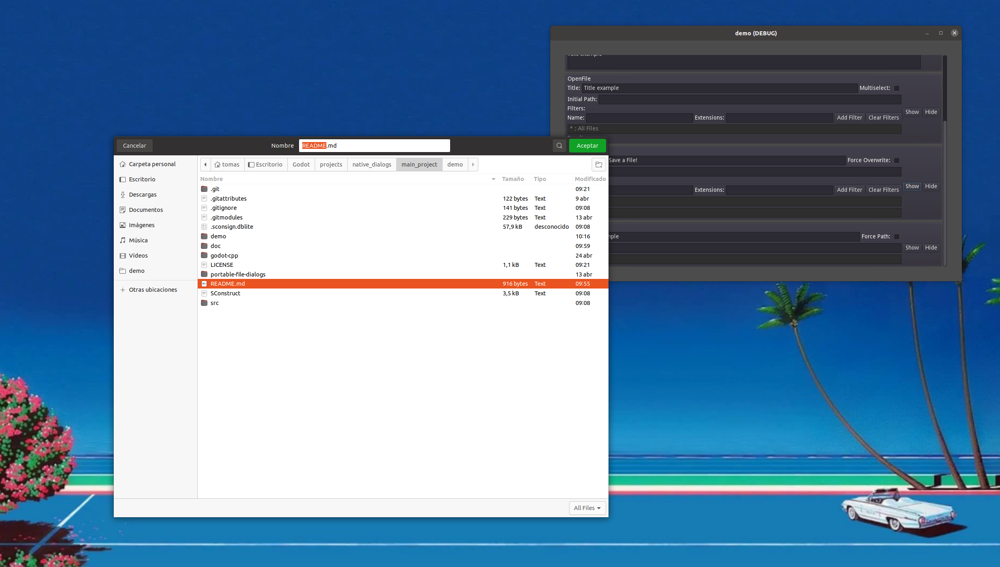
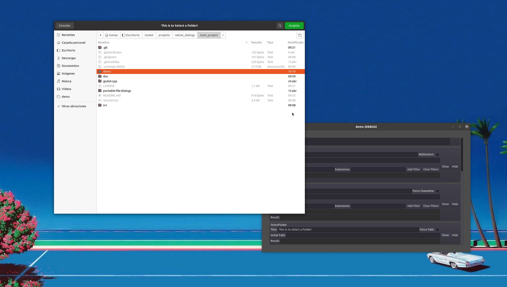

# Native Dialogs

Native Dialogs is a plugin for Godot that allows you to interact with OS-specific dialogs, such as notifications, messages and file dialogs. It adds five new nodes that wrap the functionality of the C++ Library [portable-file-dialogs](https://github.com/samhocevar/portable-file-dialogs). [`NativeDialogMessage`](#class-nativedialogmessage) allows you to prompt the user with simple accept-deny dialogs and get their answer.

[`NativeDialogNotify`](#class-nativedialognotify) would show the user a brief message and fade away. [`NativeDialogOpenFile`](#class-nativedialogopenfile), [`NativeDialogSaveFile`](#class-nativedialogsave-file) and [`NativeDialogSelectFolder`](#class-nativedialogselectfolder) all return file paths selected by the user. [`NativeDialogOpenFile`](#class-nativedialogopenfile) only allows existing files, [`NativeDialogSaveFile`](#class-nativedialogsavefile) allows the user to create a new file, and [`NativeDialogSelectFolder`](#class-nativedialogselectfolder) only allows choosing an existing folder.

Please note that this plugin follows [Godot's file paths format](https://docs.godotengine.org/en/stable/tutorials/io/data_paths.html), and it uses [`ProjectSettings`' `globalize_path` method](https://docs.godotengine.org/en/stable/classes/class_projectsettings.html?highlight=ProjectSettings#class-projectsettings-method-globalize-path) to resolve `user://`, and `res://`, so consult the documentation if you have any doubt.

## How to use it
As previously said, this plugin adds five new nodes. To use any of these nodes' functionality, you first need to add them to the scene. Them, update any of their properties. You also need to connect their signals to any method if you want to process the user's input. Finally, call the node's function that shows the native dialog to the user.

### Using the editor

Probably the more comfortable way of using this plugin:

1. Instantiate a Native Dialog's node in your scene.
2. Change any of the properties, if needed.
3. Connect its signal if you want to process the user's input.
4. Make sure to call the `show` or `send` method of the Native Dialog's node. For example, via a button's signal.

### Using code

If you want to instantiate nodes using GDScript, you may follow this example:

1. Preload the `native_dialogs.gd` script as a constant. It contains every class preloaded and defines useful enums.
2. Instantiate the desired node.
3. Change any of its attributes.
4. Connect its corresponding signal to the method that would process the user's input.
5. Add it to the scene.
6. Call the `show` or `send` method when you need to show the native dialog.

## Class `NativeDialogMessage`

Shows a brief text to the user and presents some options to choose.

### Properties

The public properties of this class are:

| Name | Description | Default   Setter   Getter |
|-|-|-|
| **title** | The title of the dialog. | `""`   set_title   get_title |
| **text** | The description of the dialog. | `""`   set_text   get_text |
| **choice** | An integer that determines the possible answers presented to the user. Which may be:   - **OK**: Represented by the number 0.   - **OK_CANCEL**: Represented by the number 1.   - **YES_NO**: Represented by the number 2.   - **YES_NO_CANCEL**: Represented by the number 3.   These values are under the `MessageChoices` enum in the `native_dialog.gd` script. | `MessageChoices.OK_CANCEL`   set_choice   get_choice |
| **icon** | An integer that determines the icon of the dialog. Which may be:   - **INFO**: Represented by the number 0.   - **WARNING**: Represented by the number 1.   - **ERROR**: Represented by the number 2.   - **QUESTION**: Represented by the number 3.   These values are under the `MessageIcons` enum in the `native_dialog.gd` script. | `MessageIcons.INFO`   set_icon   get_icon |

### Methods

The public methods of this class are:

| Name | Params | Description | Returns |
|-|-|-|-|
| **show** | None. | Creates the native dialog and presents it to the user. If this dialog is already visible, it would call `hide` first. | Nothing. |
| **hide** | None. | Destroys the currently shown dialog, if any. | Nothing. |

### Signals

The signals that this class may emit are:

| Name | Description | Values |
|-|-|-|
| **result_selected** | It is emitted when the user has pressed a button in the message dialog. | **result -> int:**   An integer that represents the button that the user has pressed. Which may be:   - **OK**: Represented by the number 0.   - **CANCEL**: Represented by the number 1.   - **YES**: Represented by the number 2.   - **NO**: Represented by the number 3.    These values are under the `MessageResults` enum in the `native_dialog.gd` script. |

## Class `NativeDialogNotify`

Sends a notification to the OS.

### Properties

The public properties of this class are:

| Name | Description | Default   Setter   Getter |
|-|-|-|
| **title** | The title of the notification. | `""`   set_title   get_title |
| **text** | The description of the notification. | `""`   set_text   get_text |
| **icon** | An integer that determines the icon of the notification. Which may be:   - **INFO**: Represented by the number 0.   - **WARNING**: Represented by the number 1.   - **ERROR**: Represented by the number 2.   These values are under the `NotifyIcons` enum in the `native_dialog.gd` script. | `NotifyIcons.INFO`   set_icon   get_icon |

### Methods

The public methods of this class are:

| Name | Params | Description | Returns |
|-|-|-|-|
| **send** | None. | Sends the notification to the OS. | Nothing. |

## Class `NativeDialogOpenFile`

Asks the user to select an existing file.

### Properties

The public properties of this class are:

| Name | Description | Default   Setter   Getter |
|-|-|-|
| **title** | The title of the dialog. | `""`   set_title   get_title |
| **initial_path** | The path the dialog would show first. | `""`   set_initial_path   get_initial_path |
| **filters** | A `PoolStringArray` that determines the available file type filters. For example: `["*.png ; PNG Images","*.gd ; GDScript Files"]`. Multiple file types can also be specified in a single filter. `"*.png, *.jpg, *.jpeg ; Supported Images"` will show both PNG and JPEG files when selected. | `["* ; All Files"]`   set_filters   get_filters |
| **multiselect** | A flag that determines if the user can select multiple files. | `false`   set_multiselect   get_multiselect |

### Methods

The public methods of this class are:

| Name | Params | Description | Returns |
|-|-|-|-|
| **show** | None. | Creates the native dialog and presents it to the user. If this dialog is already visible, it would call `hide` first. | Nothing. |
| **hide** | None. | Destroys the currently shown dialog, if any. | Nothing. |
| **add_filter** | **filter -> str:**   The filter to add. | Adds a new filter to the list of `filters`. | Nothing. |
| **clear_filters** | None. | Assigns an empty array to the dialog `filters`. | Nothing. |

### Signals

The signals that this class may emit are:

| Name | Description | Values |
|-|-|-|
| **files_selected** | It is emitted when the user has selected a file or multiple files. If the user closes the dialog without chosing one, it emits an empty array. | **files -> PoolStringArray:**   An array containing the paths of every file. |

## Class `NativeDialogSaveFile`

Asks the user to select a file, and it would prompt them if the file already exists.

### Properties

The public properties of this class are:

| Name | Description | Default   Setter   Getter |
|-|-|-|
| **title** | The title of the dialog. | `""`   set_title   get_title |
| **initial_path** | The path the dialog would show first. | `""`   set_initial_path   get_initial_path |
| **filters** | A `PoolStringArray` that determines the available file type filters. For example: `["*.png ; PNG Images","*.gd ; GDScript Files"]`. Multiple file types can also be specified in a single filter. `"*.png, *.jpg, *.jpeg ; Supported Images"` will show both PNG and JPEG files when selected. | `["* ; All Files"]`   set_filters   get_filters |
| **force_overwrite** | A flag that determines if the dialog should warn the user when selecting an existing file. | `false`   set_force_overwrite   get_force_overwrite |

### Methods

The public methods of this class are:

| Name | Params | Description | Returns |
|-|-|-|-|
| **show** | None. | Creates the native dialog and presents it to the user. If this dialog is already visible, it would call `hide` first. | Nothing. |
| **hide** | None. | Destroys the currently shown dialog, if any. | Nothing. |
| **add_filter** | **filter -> str:**   The filter to add. | Adds a new filter to the list of `filters`. | Nothing. |
| **clear_filters** | None. | Assigns an empty array to the dialog `filters`. | Nothing. |

### Signals

The signals that this class may emit are:

| Name | Description | Values |
|-|-|-|
| **file_selected** | It is emitted when the user has selected a file. If the user closes the dialog without chosing one, it emits an empty string. | **file -> str:**   An string containing the path of the selected file. |

## Class `NativeDialogSelectFolder`

Asks the user to select a folder.

### Properties

The public properties of this class are:

| Name | Description | Default   Setter   Getter |
|-|-|-|
| **title** | The title of the dialog. | `""`   set_title   get_title |
| **initial_path** | The path the dialog would show first. | `""`   set_initial_path   get_initial_path |
| **force_path** | A flag that determines if the dialog should always show the initial path, since some OS may have different behaviour. | `false`   set_force_path   get_force_path |

### Methods

The public methods of this class are:

| Name | Params | Description | Returns |
|-|-|-|-|
| **show** | None. | Creates the native dialog and presents it to the user. If this dialog is already visible, it would call `hide` first. | Nothing. |
| **hide** | None. | Destroys the currently shown dialog, if any. | Nothing. |

### Signals

The signals that this class may emit are:

| Name | Description | Values |
|-|-|-|
| **folder_selected** | It is emitted when the user has selected a folder. If the user closes the dialog without chosing one, it emits an empty string. | **folder -> str:**   An string containing the path of the selected folder. |
