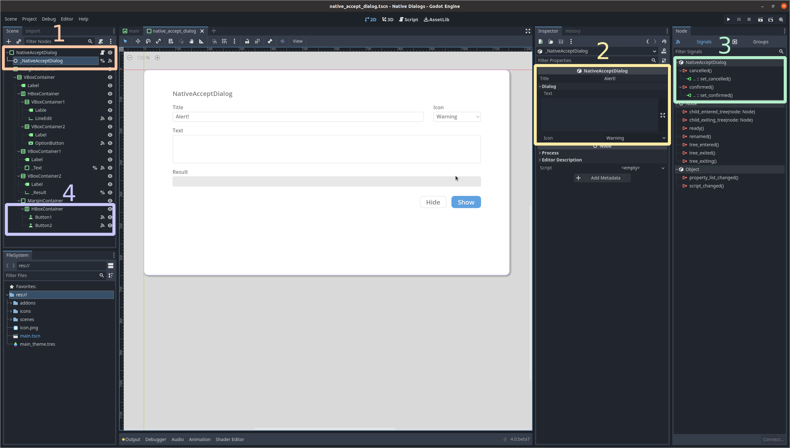

# Native Dialogs

> **Warning**
> The main branch of this repository now supports Godot 4.x. If you are looking for the Godot 3.x version, please check [this branch](https://github.com/98teg/NativeDialogs/tree/godot-3.x).

Native Dialogs is a plugin for Godot that allows you to interact with OS-specific dialogs, such as notifications, messages and file dialogs. It adds four new nodes that wrap the functionality of the C++ Library [portable-file-dialogs](https://github.com/samhocevar/portable-file-dialogs).

[`NativeAcceptDialog`](./doc/native_accept_dialog.md) is useful for small notifications to the user about an event. [`NativeConfirmationDialog`](#class-nativeconfirmationdialog) allows you to prompt the user about confirmation of actions. [`NativeNotification`](#class-nativenotification) would show the user a brief message and then fade away. And [`NativeFileDialog`](#class-nativefiledialog) is used to choose files and directories in the filesystem.

It supports the following operating systems:
* Windows
* MacOS
* Linux

Please note that this plugin follows [Godot's file paths format](https://docs.godotengine.org/en/stable/tutorials/io/data_paths.html), and it uses [`ProjectSettings`' `globalize_path` method](https://docs.godotengine.org/en/stable/classes/class_projectsettings.html?highlight=ProjectSettings#class-projectsettings-method-globalize-path) to resolve `user://`, and `res://`, so consult the documentation if you have any doubt.

## How to use it
As previously said, this plugin adds four new nodes. To use any of these nodes' functionality, you first need to add them to the scene. Then, update any of their properties if necessary. You also need to connect their signals to any method if you want to process the user's input. Finally, call the node's function that shows the native dialog to the user.

### Using the editor

Probably the more intuitive way of using this plugin:

1. Instantiate a Native Dialog's node in your scene.
2. Change any of its properties, if needed.
3. Connect its signal if you want to process the user's input.
4. Make sure to call the `show` or `send` method of the Native Dialog's node. For example, via a button's signal.



### Using code

If you want to instantiate nodes using GDScript, you may follow this example:

1. Instantiate the desired node.
2. Change any of its attributes.
3. Connect its corresponding signals to the methods that would process the user's input.
4. Add it to the scene.
5. Call the `show` or `send` method when you need to show the native dialog.


## How to build it
Here is an overview on how to compile the plugin from source:
1. Check the [official Godot documentation](https://docs.godotengine.org/es/stable/development/compiling/index.html) on how to compile the engine. You won't need to compile it, but it would help you install the necessary dependencies on your target platform.
2. Clone this repository recursively:
    ```
    git clone --recursive https://github.com/98teg/NativeDialogs
    cd NativeDialogs
    ```
3. Build the C++ bindings:
    ```
    cd godot-cpp
    scons
    cd ..
    ```
4. Compile the plugin:
    ```
    scons
    ```
5. If you have encountered any problems, check the [official Godot documentation](https://docs.godotengine.org/en/stable/tutorials/scripting/gdextension/gdextension_cpp_example.html) on how to build a GDExtension plugin.

## Classes documentation

For more information about this plugin's classes, check the following documentation:

* [`NativeAcceptDialog`](./doc/native_accept_dialog.md)
* [`NativeConfirmationDialog`](./doc/native_confirmation_dialog.md)
* [`NativeFileDialog`](./doc/native_file_dialog.md)
* [`NativeNotification`](./doc/native_notification.md)
