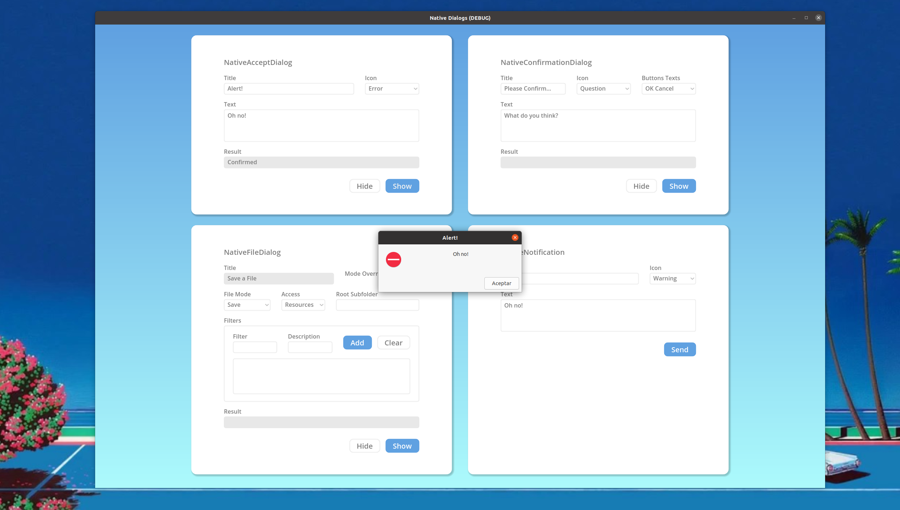

# `NativeAcceptDialog`

## Description

This dialog is useful for small notifications to the user about an event. It can only be accepted or closed. The functionality of this node is already implemented in Godot via the `OS.alert()` method, althought it doesn't let you customize the icon.



## Properties

|Type|Name|Default value|
|-|-|-|
|[`Icon`](#enum-icon)|[`dialog_icon`](#icon-dialog_icon--1)|`1`|
|`String`|[`dialog_text`](#string-dialog_text--)|`""`|
|`String`|[`title`](#string-title--alert)|`"Alert!"`|

## Methods

|Returned type|Declaration|
|-|-|
|`void`|[`hide()`](#void-hide)|
|`void`|[`show()`](#void-show)|

## Signals

### `canceled()`

Emitted when the dialog is closed.

### `confirmed()`

Emitted when the dialog is accepted, i.e. the OK button is pressed.

## Enumerations

### `enum Icon`

```gdscript
Icon ICON_INFO = 0
```

Usually an icon with the letter i in a blue circle*.

```gdscript
Icon ICON_WARNING = 1
```

Usually an icon with an exclamation mark in a yellow triangle*.

```gdscript
Icon ICON_ERROR = 2
```

Usually an icon with a cross in a red circle*.

```gdscript
Icon ICON_QUESTION = 3
```

Usually an icon with a question mark*.

**(*)** Depends on your OS theme.

## Property Descriptions

### `Icon dialog_icon = 1`

The icon displayed by the dialog.

```gdscript
void set_icon(Icon value)

Icon get_icon()
```

### `String dialog_text = ""`

The text displayed by the dialog.

```gdscript
void set_text(String value)

String get_text()
```

### `String title = "Alert!"`

The dialog's title.

```gdscript
void set_title(String value)

String get_title()
```

## Method Descriptions

### `void hide()`

Hides the dialog.

### `void show()`

Makes the dialog appear. If this dialog is already visible, it would call [`hide`](#void-hide) first.
