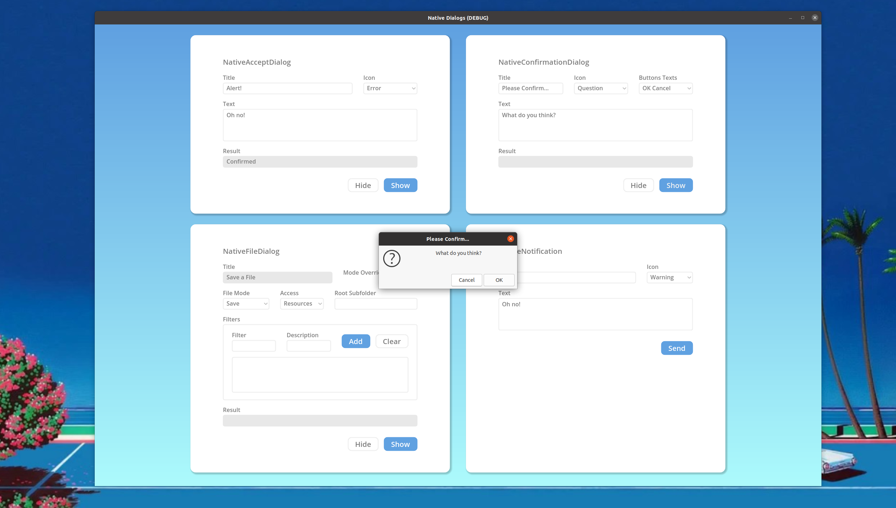

# `NativeConfirmationDialog`

## Description

Dialog for confirmation of actions. This dialog inherits from [`NativeAcceptDialog`](./native_accept_dialog.md),



## Properties

|Type|Name|Default value|
|-|-|-|
|[`ButtonsTexts`](#enum-buttonstexts)|[`buttons_texts`](#buttonstexts-buttons_texts--0)|`0`|
|[`Icon`](./native_accept_dialog.md#enum-icon)|[`dialog_icon`](./native_accept_dialog.md#icon-dialog_icon--1)|`3` (overrides [`NativeAcceptDialog`](./native_accept_dialog.md))|
|`String`|[`title`](./native_accept_dialog.md#string-title--alert)|`"Please Confirm..."` (overrides [`NativeAcceptDialog`](./native_accept_dialog.md))|

## Enumerations

### `enum ButtonsTexts`

```gdscript
ButtonsTexts BUTTONS_TEXTS_OK_CANCEL = 0
```

Pressing `OK` would emit the [`confirmed`](./native_accept_dialog.md#confirmed) signal and pressing `Cancel` would emit the [`cancelled`](./native_accept_dialog.md#cancelled) signal.

```gdscript
Icon BUTTONS_TEXTS_YES_NO = 1
```

Pressing `Yes` would emit the [`confirmed`](./native_accept_dialog.md#confirmed) signal and pressing `No` would emit the [`cancelled`](./native_accept_dialog.md#cancelled) signal.

## Property Descriptions

### `ButtonsTexts buttons_texts = 0`

The text that would be displayed inside the dialog's buttons.

```gdscript
void set_buttons_texts(ButtonsTexts value)

ButtonsTexts get_buttons_texts()
```
