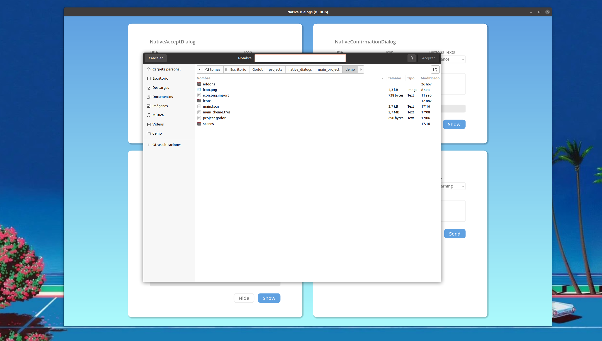

# `NativeFileDialog`

## Description

NativeFileDialog is a dialog used to choose files and directories in the filesystem. It supports filter masks. The NativeFileDialog automatically sets its window title according to the `mode`. If you want to use a custom title, disable this by setting `mode_overrides_title` to `false`.



## Properties

|Type|Name|Default value|
|-|-|-|
|[`Access`](#enum-access)|[`access`](#access-access--0)|`0`|
|[`FileMode`](#enum-filemode)|[`file_mode`](#filemode-file_mode--3)|`3`|
|`PoolStringArray`|[`filters`](#packedstringarray-filters--packedstringarray)|`PoolStringArray()`|
|`bool`|[`mode_overrides_title`](#bool-mode_overrides_title--true)|`true`|
|`String`|[`root_subfolder`](#string-root_subfolder--)|`""`|
|`String`|[`title`](#string-title--save-a-file)|`"Save a File"`|

## Methods

|Returned type|Declaration|
|-|-|
|`void`|[`add_filter(String filter, String description="")`](#void-add_filterstring-filter-string-description)|
|`void`|[`clear_filters()`](#void-clear_filters)|
|`void`|[`hide()`](#void-hide)|
|`void`|[`show()`](#void-show)|

## Signals

### `dir_selected(String dir)`

Emitted when the user selects a directory.

### `file_selected(String path)`

Emitted when the user selects a file by double-clicking it or pressing the **OK** button.

### `files_selected(PoolStringArray paths)`

Emitted when the user selects multiple files.

### `cancelled()`

Emitted when the dialog is closed.

## Enumerations

### `enum FileMode`

```gdscript
FileMode MODE_OPEN_FILE = 0
```

The dialog allows selecting one, and only one file.

```gdscript
FileMode MODE_OPEN_FILES = 1
```

The dialog allows selecting multiple files.

```gdscript
FileMode MODE_OPEN_DIR = 2
```

The dialog only allows selecting a directory, disallowing the selection of any file.

```gdscript
FileMode MODE_SAVE_FILE = 3
```

The dialog will warn when a file exists.

### `enum Access`

```gdscript
Access ACCESS_RESOURCES = 0
```

The dialog is initiated under the Resource path (`res://`).

```gdscript
Access ACCESS_USERDATA = 1
```

The dialog is initiated under the user data path (`user://`).

```gdscript
Access ACCESS_FILESYSTEM = 2
```

The dialog allows accessing files on the whole file system.

## Property Descriptions

### `Access access = 0`

The file system access scope. See enum `Access` constants. Changing this value would reset `root_subfolder`. So when using code, you need to set `access` before `root_subfolder`.

```gdscript
void set_access(Access value)

Access get_access()
```

### `FileMode file_mode = 3`

The dialog's open or save mode, which affects the selection behavior. See `FileMode`.

```gdscript
void set_file_mode(FileMode value)

FileMode get_file_mode()
```

### `PackedStringArray filters = PackedStringArray()`

The available file type filters. For example, this shows only `.png` and `.gd` files: `set_filters(PackedStringArray(["*.png ; PNG Images","*.gd ; GDScript Files"]))`. Multiple file types can also be specified in a single filter. `"*.png, *.jpg, *.jpeg ; Supported Images"` will show both PNG and JPEG files when selected.

```gdscript
void set_filters(PackedStringArray value)

PackedStringArray get_filters()
```

### `bool mode_overrides_title = true`

If `true`, changing the `Mode` property will set the window title accordingly (e.g. setting mode to `FILE_MODE_OPEN_FILE` will change the window title to "Open a File").

```gdscript
void set_mode_overrides_title(bool value)

bool is_mode_overriding_title()
```

### `String root_subfolder = ""`

The subfolder where the native dialog would start.

```gdscript
void set_root_subfolder(String value)

String get_root_subfolder()
```

### `String title = "Save a File"`

The dialog's title.

```gdscript
void set_title(String value)

String get_title()
```

## Method Descriptions

### `void add_filter(String filter, String description="")`

Adds a comma-delimited file name `filter` option to the **FileDialog** with an optional `description`, which restricts what files can be picked.

A `filter` should be of the form `"filename.extension"`, where filename and extension can be * to match any string. Filters starting with `.` (i.e. empty filenames) are not allowed.

For example, a `filter` of `"*.png, *.jpg"` and a description of `"Images"` results in filter text `"Images (*.png, *.jpg)"`.

### `void clear_filters()`

Clear all the added filters in the dialog.

### `void hide()`

Hides the dialog.

### `void show()`

Makes the dialog appear. If this dialog is already visible, it would call [`hide`](#void-hide) first.
